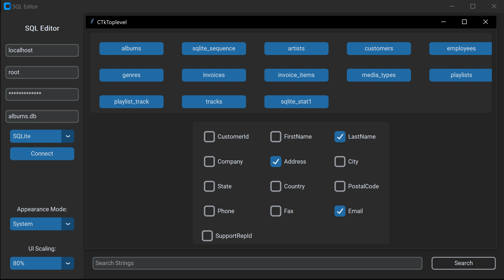
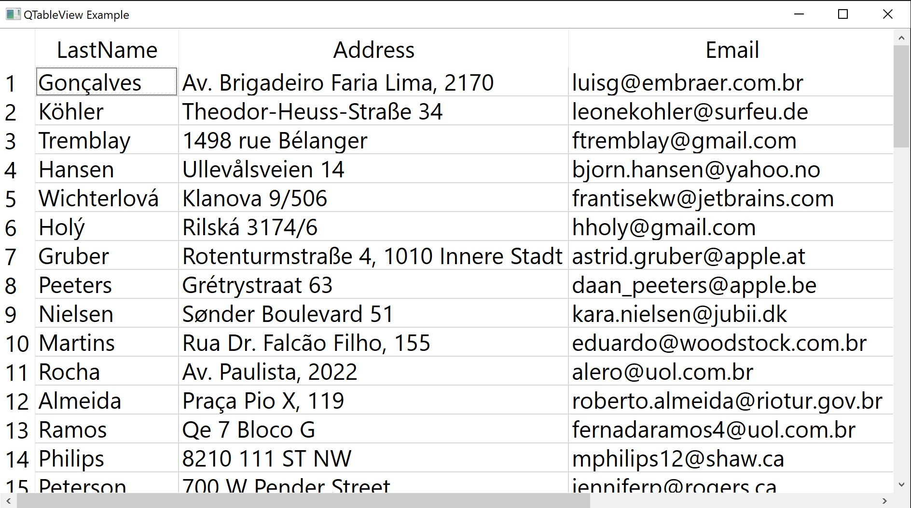
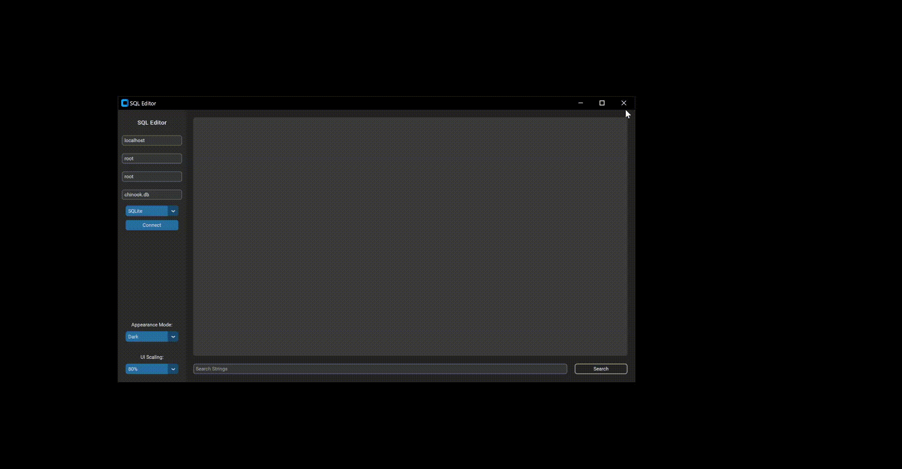

This is a Python program that allows you to edit SQL tables and databases using a graphical user interface. It uses the PySide6 Qt and customtkinter for its GUI. To install you can either git clone the repo or download it as a zip file. Once downloaded, you can navigate to the folder and install the dependencies by following the below [installation instructions](#Installation).

 

## Usage

1.  Run the `sqleditor.py` file to start the application.
2.  In the sidebar, fill in the database connection information (host, user, password, database, and driver) and click the "Connect" button to establish a connection.
3.  Once connected, a window will display the contents of the selected database. Select which table you would like to view along with which columns you would like displayed and close the window. 
4.  Use the search box to filter the data and hit the "Search" button to display the table.
5.  View or change whatever on the table and the changes will be updated in real time on the original database. (Note: You can also use the sidebar options to change the appearance mode and UI scaling.)

## Demo

## Installation

##### Download Python

This was made using Python 3.10.5, but any version above 3.7+ should be compatible. Here's the link to the downloads:
https://www.python.org/downloads/release/python-3105/

##### Install Python Modules

After installing Python, navigate to the `src` folder where this repo was installed and run the following command:
`pip install -r requirements.txt`

This will start installing all the modules needed for the app to run. Select 'y' for any prompts asking whether you would like to proceed with the installation.

##### Install Drivers

After all the modules are successfully installed, you need to copy the files in the folder `drivers` to the specific folder where PySide6 checks for drivers. To find this location, run the following command: `pip show PySide6` and go to the folder under the field "Location. " This will more than likely be something similar to `c:\users\{USERNAME}\appdata\local\programs\python\{PYTHONVERSION}\lib\site-packages`

From there, go to `\PySide6\plugins\sqldrivers` and paste the files from `drivers` there.

##### Running The Program

From there, all you need to do is run the program by navigating to `src` and running `python sqleditor.py` which should give you the main app screen
